# COMPUTE

* [Processes](#processes)
* [Threads](#threads)
* [Scheduling](#scheduling---why)
* [Synchronization](#synchronization---why)

---

### Backstory

Apps running while you are doing your homework:
* Code editor
* Browser with 10+ https://stackoverflow.com/ tabs
* Discord
* Spotify
* Torrent client
* Crypto miner
* The OS itself

Only one CPU. How?

----

### Some CPU internals

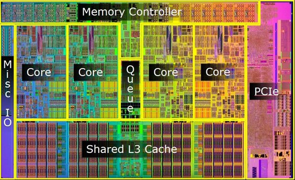

* More **cores** per CPU
* Still not enough for all processes

----

### All Processes in a System

```
student@os ~ $ ps -e | wc -l
32
student@os ~ $ ps -e
  PID TTY          TIME CMD
    1 ?        00:00:00 init
  914 ?        00:00:00 init
 2582 ?        00:00:07 gpg-agent
19812 ?        00:00:00 init
19813 ?        00:00:00 init
19814 pts/0    00:00:00 bash
20650 ?        00:00:00 init
20651 ?        00:00:00 init
20652 pts/1    00:00:00 sh
20653 pts/1    00:00:00 sh
20658 pts/1    00:00:00 sh
20661 pts/1    00:00:03 node
20672 ?        00:00:00 init
20673 ?        00:00:00 init
20674 pts/2    00:00:00 node
20681 pts/1    00:00:00 node
20701 ?        00:00:00 init
20702 ?        00:00:00 init
20703 pts/3    00:00:01 node
20722 pts/1    00:00:00 node
20733 pts/1    00:00:18 node
20796 pts/1    00:00:25 node
20915 ?        00:00:00 init
20916 ?        00:00:00 init
20917 pts/4    00:00:00 bash
20964 pts/4    00:00:00 python3
20981 ?        00:00:00 init
20982 ?        00:00:00 init
20983 pts/5    00:00:00 bash
21045 pts/5    00:00:00 ps
```

Way more processes than cores!

---

### Processes

* A process is a **running program**
* An application can spawn multiple processes
* The OS allows each process to run on a **core** for a few milliseconds (time slice)
* Then the OS pauses the process and replaces it with another one (context switch)

----

### Scheduling - Overview

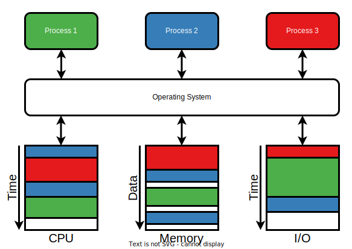

----

### What We Want

* Run more apps than cores
* Efficient scheduling
* Encapsulation and separation of tasks:
    * VAS: isolate data
    * CPU: computations, threads
    * I/O: network packets, files

----

### What We Don't Want

* Unresponsive processes
* Processes monopolizing resources
* System freezes

---

### Process Address Space

* Each process has its own VAS:
    * Isolation
    * The process "thinks" it uses the entire address space

----

### Process Address Space

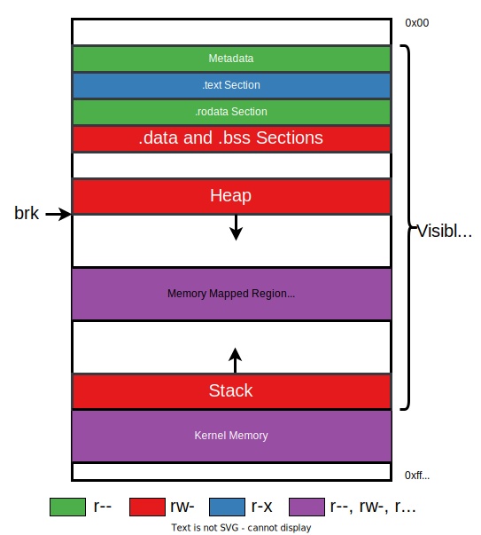

---

## Process Attributes - from User Space

* PID: numeric identifier
* PPID: parent's PID (one parent per process)
* Running time
* State: we will discuss this later

```
student@os create-thread $ python3 create_thread.py
[main] PID = 16066; PPID = 7820
[thread] PID = 16066; PPID = 7820
```

----

### Process Attributes - from User Space

`ps`:
```
student@os ~ $ ps -e --forest -o pid,ppid,rss,vsz,etime,stat,comm
  PID  PPID   RSS    VSZ     ELAPSED STAT COMMAND
    1     0   600    988  2-02:44:02 Sl   init
  914     1    88    900  2-02:14:06 S    init
 2582   914  3376  82956  1-04:15:56 Ss    \_ gpg-agent
19812     1   176    988    09:03:34 Ss   init
19813 19812   176    988    09:03:34 S     \_ init
19814 19813  6420  11256    09:03:34 Ss        \_ bash
21713 19814  3132  10696       00:00 R+            \_ ps
20650     1   176    988    05:43:41 Ss   init
20651 20650   176    988    05:43:41 S     \_ init
20652 20651   604   2612    05:43:41 Ss+       \_ sh
20653 20652   536   2612    05:43:41 S+            \_ sh
20658 20653   604   2612    05:43:41 S+                \_ sh
20661 20658 74072 931768    05:43:41 Sl+                   \_ node
20681 20661 44316 614424    05:43:40 Sl+                       \_ node
20722 20661 39804 828152    05:43:40 Sl+                       \_ node
20733 20661 147004 845832   05:43:40 Sl+                       \_ node
20796 20733 119336 959952   05:43:38 Sl+                           \_ node
21149 20733 41080 581504    04:31:20 Sl+                           \_ node
20672     1   176    988    05:43:40 Ss   init
20673 20672   176    988    05:43:40 S     \_ init
20674 20673 41556 585172    05:43:40 Ssl+      \_ node
20701     1   176    988    05:43:40 Ss   init
20702 20701   176    988    05:43:40 S     \_ init
20703 20702 48060 590308    05:43:40 Ssl+      \_ node
20915     1   176    988    05:24:46 Ss   init
20916 20915   176    988    05:24:46 S     \_ init
20917 20916  5268  10188    05:24:46 Ss        \_ bash
20964 20917 19840 516296    05:24:32 S+            \_ python3
20981     1   176    988    05:22:54 Ss   init
20982 20981   176    988    05:22:54 S     \_ init
20983 20982  5100  10056    05:22:54 Ss+       \_ bash
```

----

### Process Attributes - from Kernel Space

* PCB (Process Control Block):
    * Data structure in the kernel - `task_struct`
    * All information about the process (from `ps`, `/proc`):

----

### Process Attributes - from Kernel Space

The most important fields in `task_struct`:
```c [2 | 4 | 6 | 8 - 9 | 11 - 13 | 15 - 16 | 18 - 19 | 21 | 23 | 25 - 26 | 28 - 29]
struct task_struct {
        unsigned int                    __state;

        void                           *stack;

        unsigned int                    flags;

        int                             on_cpu;
        int                             prio;

        /* Scheduler information */
        struct sched_entity             se;
        const struct sched_class        *sched_class;

        /* The VAS: memory mappings */
        struct mm_struct                *mm;

        int                             exit_state;
        int                             exit_code;

        pid_t                           pid;

        struct task_struct __rcu        *parent;

        /* Child processes */
        struct list_head                children;

        /* Open file information */
        struct files_struct             *files;
};
```

---

### `fork`

* Spawns child process
* Child process starts execution right after the call to `fork`
* Returns twice
    * `0` in child process
    * Child's PID in parent process
* Initially child and parent share the same PAS
* Child's writable pages marked **copy-on-write**

----

### Copy-on-write

When `fork` returns, the child inherits the parent's page table.

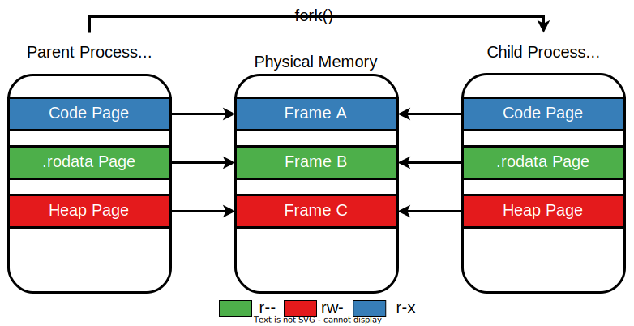

----

### Copy-on-write

* Writable pages are **copied and modified** when written: `demo/copy-on-write/copy_on_write_overhead.c`.

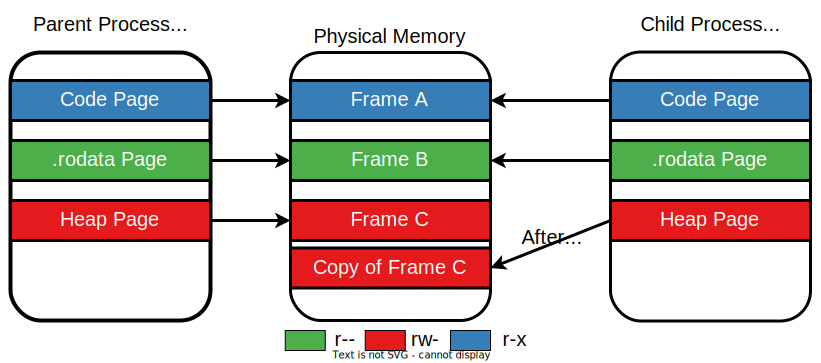

---

### Threads

* Each process has at least one thread
* Lightweight processes (LWP)
* Scheduling unit

---

### Thread - Resources

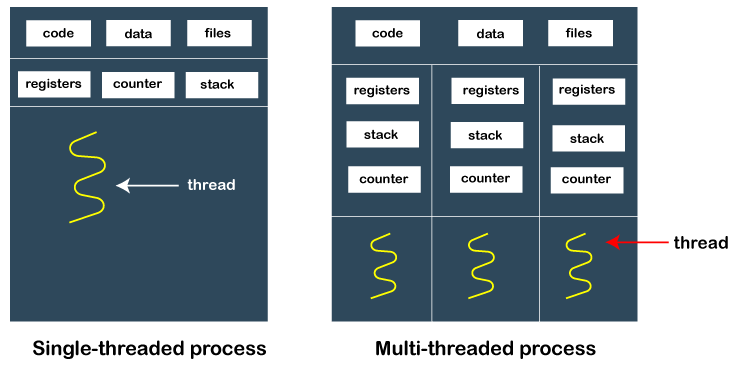

----

### App, Process, Thread - The Bigger Picture

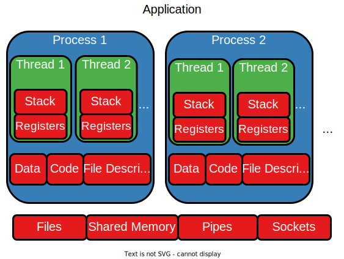

---

### Process vs Thread

| Process                          | Thread                               |
| :------------------------------: | :----------------------------------: |
| independent                      | part of a process                    |
| isolated VAS                     | share VAS with other threads         |
| expensive creation               | faster creation                      |
| costly context switch            | shorter context switch               |
| all threads closed when finished | other threads continue when finished |
| Linux syscall: `clone()`         | Linux syscall: `clone()`             |

----

### Process vs Thread

`demo/create-thread/create_thread.py`

vs

`demo/create-process/create_process.py`

---

### Scheduling - Why?

* For multitasking: more threads than CPU cores
* For responsiveness: small waiting time
* For productivity: execute more threads

----

### Typical Thread Execution 

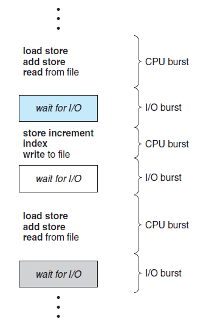

----

### Thread States

* At most one RUNNING thread per core
* Queues for BLOCKED and READY processes


A more detailed diagram is [here](#the-suspended-states)

---

### Context Switch - When?

* Voluntary - initiated by the running thread:
    * RUNNING thread performs a blocking action (eg: I/O call)
    * The thread calls `yield()` / `SwitchToThread()`
* Involuntary - initiated by the OS:
    * RUNNING thread ends
    * RUNNING thread's time slice expires
    * A thread with higher priority is spawned

----

### Context Switch - How?


---

### Types of Threads

* CPU-intensive / CPU-bound = mostly CPU bursts:
    * compute the digits of pi
    * compilers
    * machine learning
* I/O-intensive / I/O-bound = mostly I/O bursts:
    * servers
    * databases
    * text editors

----

### IO-bound vs CPU-bound

* `demo/context-switch/cpu_bound.c`:
```
student@os ~ $ cat /proc/$(pidof cpu_bound)/status
[...]
voluntary_ctxt_switches:        13
nonvoluntary_ctxt_switches:     7
```

* `demo/context-switch/io_bound.c`:
```
student@os ~ $ cat /proc/$(pidof io_bound)/status
[...]
voluntary_ctxt_switches:        3729
nonvoluntary_ctxt_switches:     3
```

---

### Context Switch - Overhead

* Causes of overhead:
    * running the scheduler itself
    * flushing the TLB of the evicted thread
* Faster context switches between threads of the same process because their TLB is not flushed

---

### Scheduling - Ideals

* **Interactivity:** decrease time spent in READY
    * low waiting time
    * also known as **fairness**
* **Throughput:** finish threads as quickly as possible
    * low turnaround time

----

### Scheduling - Reality

* There is no free lunch
* Tradeoff between interactivity and throughput

----

### Types of Schedulers

* **Cooperative:** only allow voluntary context switches
    * Advantage: Simple to implement
    * Disadvantage: starvation - a thread might never yield its CPU core
* **Preemptive:** also allows involuntary context switches
    * Each process can run at most a certain _time slice_ / _quantum_
    * When it expires, a context switch is triggered

---

### Scheduling Algorithms - Round-Robin

1. Add each new thread to a queue
2. Remove one thread from the queue and run it
3. The thread runs until finished or until its time slice ends
4. If the thread is not finished, add it back to the queue
5. Repeat from step 2

----

### Round-Robin - Example

| Process | Running time |
| :-----: | :----------: |
| P1      | 4            |
| P2      | 3            |
| P3      | 5            |

* Assume a time slice of 2

----

### Round-Robin - Live Scheduling

<video width="590" controls>
    <source src="media/round-robin.mp4" type="video/mp4">
</video>

----

### Round-Robin - Analysis

* Large time slice:
    * high throughput (fewer context switches)
    * low fairness (threads at the back of the queue spend more time in READY)
* Small time slice:
    * low throughput
    * high fairness 

----

## Round-Robin - Real Life (Unikraft)

* [Cooperative scheduler](https://github.com/unikraft/unikraft/blob/staging/lib/ukschedcoop/schedcoop.c)
* Lists used as queues for READY and WAITING processes:
```c
struct schedcoop_private {
	struct uk_thread_list thread_list;
	struct uk_thread_list sleeping_threads;
};
```
* `yield` means scheduling another thread:
```c
static void schedcoop_yield(struct uk_sched *s)
{
	schedcoop_schedule(s);
}
```

---

### Completely Fair Scheduler (CFS)

* Schedule the thread that has run **the least amount of time (vruntime)**
* Store READY threads in a **Red-Black Tree**, sorted by **vruntime**
* Use time slices, like Round-Robin
* During a context switch:
    * If the currently RUNNING task is over, terminate it
    * Otherwise, increase its vruntime and add it to RBTree
    * Move the **leftmost** thread in RBTree to RUNNING

----

### CFS - Analysis

* Context switch complexity:
    * Add thread to RBTree: `O(log(num_threads))`
    * Extract leftmost thread in the RBTree: `O(1)` (keep a pointer to it)
    * Overall complexity: `O(log(num_threads))`
* Time slice size: same tradeoff as Round-Robin

---

### Fixed Priority Scheduling

* Each thread has a priority
* Threads with higher priority run more often
* Threads with lower priority are starved
* Easier to implement

----

### Fixed Priority Scheduling - `nice`

* Lower `nice`-ness = higher priority
* Values in `[-20, 19]`

```bash [1 - 2 | 3 - 8 | 9 - 10 | 11 - 12]
student@os ~ $ nice -10 bash &
[1] 5753
student@os ~ $ ps -e -o pid,ni,comm
  PID  NI COMMAND
    1   0 init
 [...]
 5753  10 bash
 5752   0 ps
student@os ~  $ sudo renice -n -20 -p 5753
5753 (process ID) old priority 10, new priority -20
student@os ~ $ ps -e -o pid,ni,comm | grep 5753
 5753 -20 bash
```

----

### Priority-Based Round-Robin

* The scheduler keeps a list of queues, one for each priority
* During a context switch, the new RUNNING thread is chosen from the highest priority non-empty queue 

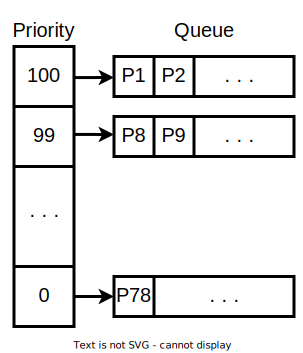

---

### Dynamic-Priority Scheduling

* Problems with static priorities:
    * Low-priority threads are starved
    * Unfair for I/O bound threads
* Solution:
    * Decrease priority of RUNNING threads
    * Increase priority of WAITING threads

---

### Synchronization - Why?

* Each thread believes it's the only one running
* ... but this is not true
* Threads share resources:
    * RAM
    * files
    * networking
    * CPU

----

### Synchronization - How?

* We want to give a thread **exclusive access** to a resource at a given time
* Other threads **wait** to receive access

----

### Synchronization - Example

* `demo/race-condition/race_condition.c`
* `var++` equivalency (**critical section**):

<video controls>
    <source src="media/race-condition.mp4" type="video/mp4">
</video>

* In the end `var = 1` or `var = 2`

----

### Synchronization Mistake - TOCTOU

```c
if (lock = 0) {
	lock = 1;
    /* critical section */
    lock = 0;
}
```

<video controls>
    <source src="media/race-condition-toctou.mp4" type="video/mp4">
</video>

* **Wrong:** both threads execute the critical section at the same time

----

### Synchronization - Solution

* Only allow **one thread** to access the critical section at a given time (mutual exclusion)

<video controls>
    <source src="media/race-condition-lock.mp4" type="video/mp4">
</video>

* In the end `var` is **always** 2

---

### Mutual Exclusion - Atomicity

* Access to a resource is restricted to a single thread
* Use **atomic** instructions provided by the ISA: (on x86: the `lock` prefix)
    * Eg: `lock inc dword [var]`
    * The CPU core has exclusive access to the cache and data bus while executing the instruction
* Use architecture-independent wrappers:
    * [GCC built-ins](https://gcc.gnu.org/onlinedocs/gcc/_005f_005fatomic-Builtins.html) (eg. `__atomic_add_fetch`)
    * libc functions from [`stdatomic.h`](https://en.cppreference.com/w/c/atomic) (eg. `atomic_flag_test_and_set`)

----

### Mutual Exclusion - Spinlock

* Makes critical section **atomic**
* `lock` - **busy-waiting**: loop until you gain access (`lock == 1`):

```c
void spin_lock()
{
	while (atomic_flag_test_and_set(&lock))
		;
}
```

* `unlock` - simple assignment.
* The result is the same even with race conditions

```c
void spin_unlock()
{
	lock = 0;
}
```

----

### Spinlock - Analysis

* Advantages:
    * Simple to implement
    * Fast when lock is (almost) immediately acquired
* Disadvantage:
    * Overhead: runs on the CPU while waiting for the lock (doing nothing)

---

### Mutual Exclusion - Mutex

```c [1 - 3 | 5 - 9 | 12 - 19 | 21 - 26]
struct mutex {
	/* Use internal lock for `atomic_flag_test_and_set`. */
	int lock;

	/**
	 * Store WAITING threads in this queue. Move one thread to READY when
	 * another one calls `mutex_unlock`.
	 */
	struct queue *queue;
};

void mutex_lock(struct mutex *m)
{
	while (atomic_flag_test_and_set(&m->lock)) {
        thread = current_thread();
		queue_push(m->queue, thread);
		move_to_waiting(thread);
    }
}

void mutex_unlock(struct mutex *m)
{
	m->lock = 0;
	thread = queue_pop(m->queue);
	move_to_ready(thread);
}
```

----

### Mutex - Analysis

* Prevents overhead from busy-waiting
* Threads move to WAITING state while waiting for the lock
* Introduces overhead from context switch

---

### Mutual Exclusion - Overhead

* The more complex the synchronization mechanism, the higher the overhead:

``` [1 - 2 | 3 - 4 | 5 - 6 | 7 - 8]
student@os race-condition $ ./race_condition
var = 1232611; time = 14 ms
student@os race-condition $ ./race_condition_atomic
var = 2000000; time = 31 ms
student@os race-condition $ ./race_condition_spinlock
var = 2000000; time = 73 ms
student@os race-condition $ ./race_condition_mutex
var = 2000000; time = 98 ms
```

* Why is the spinlock faster?
    * **Short** critical section, so the lock is acquired fast
    * The context switches performed by the mutex are costlier

----

## Critical Section - Granularity

* What if we place all the code in `increase_var` in a critical section?
* Short critical sections mean more frequent context switches
* Large critical sections mean less parallelism (code runs almost sequentially)

```
student@os granularity $ ./coarse_granularity
var = 2000000; time = 36 ms
student@os granularity $ ./fine_granularity
var = 2000000; time = 1268 ms
```

---

## Semaphore

* Generalized mutex (mutex = binary semaphore)
* Lock can take values greater than 1
* `acquire_lock() ~ lock--`:
    * Threads enter critical section if `lock > 0`
    * Threads block if `lock == 0`
* `release_lock() ~ lock++`

----

### Spinlock vs Mutex vs Semaphore

| Spinlock                                 | Mutex                                    | Semaphore                                   |
| :--------------------------------------- | :--------------------------------------- | :------------------------------------------ |
| Busy waiting                             | Yields CPU                               | Yields CPU                                  |
| Good for short critical sections         | Good for complex critical sections       | Good for complex critical sections          |
| Only 1 thread can enter critical section | Only 1 thread can enter critical section | Multiple threads can enter critical section |

---

### Deadlock

* Circular dependency
* Threads cyclically wait for each other

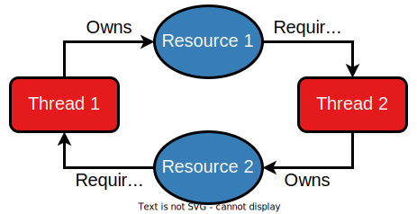

```
student@os deadlock $ ./deadlock
Thread 1: locked resource 1. Waiting for resource 2...
Thread 2: locked resource 2. Waiting for resource 1...

```

* Now the threads are deadlocked

---

### Barrier

* The code before the barrier is executed by **all threads** before the code after the barrier
* Threads move to WAITING upon reaching the barrier
* Threads move back to READY when the last thread reaches the barrier
* `demo/barrier/barrier.c`

---

### Condition Variables

* More complex synchronization logic
* Similar to but more flexible than semaphores
* A thread is suspended until a condition (logical predicate) is met
* Always used with mutexes (evaluating the condition is **not atomic**)

----

### Condition Variables - API

* `wait`: suspend the thread until the condition is met
    * used in a loop:
```c
while (!condition) {
		/* The mutex is automatically unlocked before waiting. */
		wait(&condition, &mutex);
}
```
* `signal`: wake up **one** thread waiting on the condition
* `broadcast`: wake up **all** threads waiting on the condition
* `demo/condition/cond_barrier.c`

---

## Cool Extra Stuff

---

### `fork` and `exec`

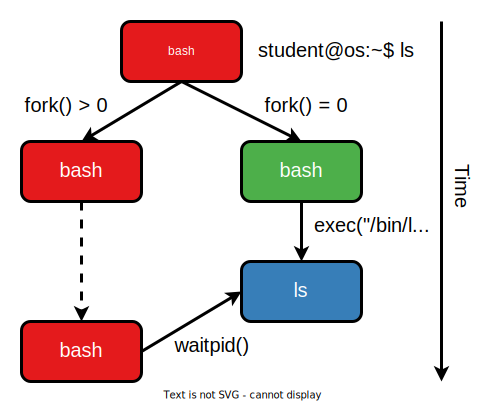

Follow the code in `demo/create-process/fork_exec.c`

----

### Linux vs Windows

* Go to `demo/create-process` and compare:
    * `fork_exec.c`
    * `posix_spawn.c`
    * `create_process.c`

---

### Linux Syscalls

```
student@os create-process $ strace ./fork_exec
[...]
clone(child_stack=NULL, flags=CLONE_CHILD_CLEARTID|CLONE_CHILD_SETTID|SIGCHLD, child_tidptr=0x7f7e83aa4810) = 5279
[...]
```
* `fork` and `pthread_create` are `libc` wrappers to the same syscall: `clone`

----

### `fork` vs `pthread_create`

``` [1 - 2 | 3 - 4]
student@os create-process $ strace -e clone ./fork_exec
clone(child_stack=NULL, flags=CLONE_CHILD_CLEARTID|CLONE_CHILD_SETTID|SIGCHLD, child_tidptr=0x7f7e83aa4810) = 5302
student@os create-thread $ strace -e clone ./create_thread
clone(child_stack=0x7f9ea7df0fb0, flags=CLONE_VM|CLONE_FS|CLONE_FILES|CLONE_SIGHAND|CLONE_THREAD|CLONE_SYSVSEM|CLONE_SETTLS|CLONE_PARENT_SETTID|CLONE_CHILD_CLEARTID, tls=0x7f9ea7df1700, child_tidptr=0x7f9ea7df19d0) = 5389
```
* From the flags, the parent and the child **thread** share:
    * `CLONE_VM`: VAS (no copy-on-write)
    * `CLONE_FS`: FS information (root, umask, cwd)
    * `CLONE_FILES`: File descriptor table
    * `CLONE_SIGHAND`: Signal handlers

---

### The Suspended States


----

### The Suspended States

* **SUSPENDED READY / WAITING:** placed on secondary storage (**swap area**) due to lack of RAM
    * Brought back to READY / WAITING when more RAM is available
* Threads can move from SUSPENDED WAITING to SUSPENDED READY when I/O completes
* Impossible to move from SUSPENDED READY to SUSPENDED WAITING (threads cannot perform I/O calls without running)

---

### User Level Threads

* Advantages:
    * blocking actions only stall current thread
    * hardware (SMP) support
* Disadvantages:
    * slow context switch
    * difficult to implement and maintain
    * kernel space scheduler (more complex)

----

### Thread Implementations

| User level                       | Kernel level                               |
| :------------------------------: | :----------------------------------------: |
| implemented by libraries         | implemented by the kernel                  |
| blocking actions stall process   | blocking actions only stall current thread |
| more mapped on one kernel thread | provide support for user level threads     |
| Java, Python, POSIX threads      | Linux KThreads, Windows threads            |
