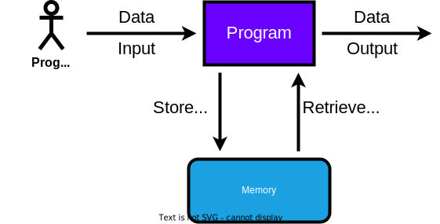
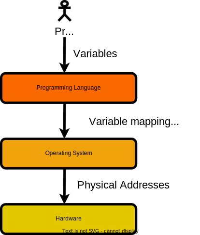
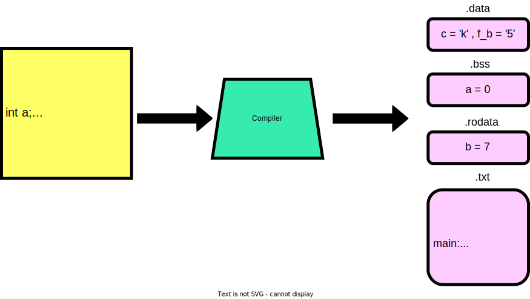
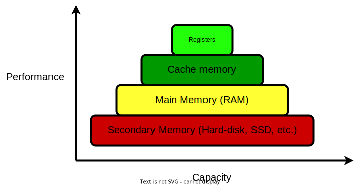
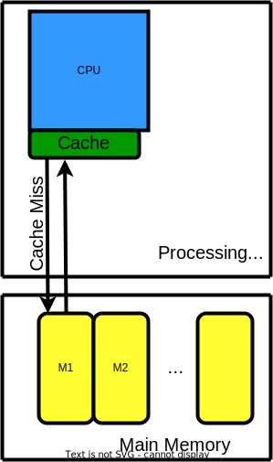
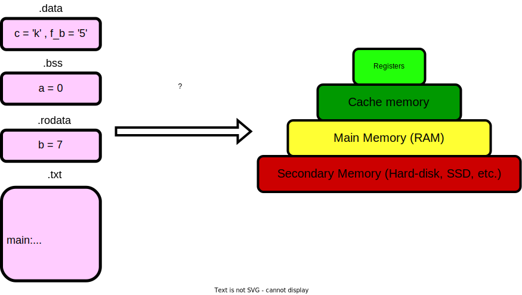
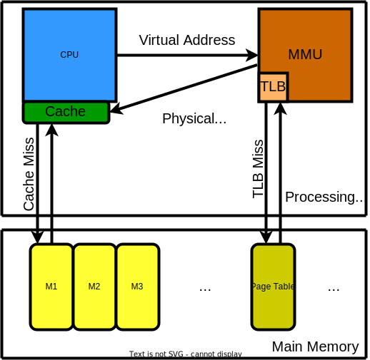

# DATA

1. What is data?
1. Stages of data
1. Programming language perspective
1. Hardware perspective
1. Virtual Memory
---
## What is data?

* Generally: factual information (such as measurements or statistics) used as a basis for reasoning, discussion, or calculation.
* Computer science: information in digital form that can be transmitted or processed.
---

## What is data?

---

## What is data?

---

## User perspective on data

* Data = variables
* Operations: declare/read/write
* If data is stored in memory, who does the allocation/deallocation?

---

## Who manages memory?

* You (the programmer)
* The programming language
* A library implementation
* The operating system

---

## Stages of data

---

## Programming language perspective

---

## Hardware perspective

---

## Hardware Perspective

---

## How is it mapped?

---

## Virtual Memory Architecture

---

## TODO

1. Example with 2 processes trying to access the same address. => virtual memory
2. In the end, provide an example where a process may modify a variable in a different process by using /proc/$pid/maps, /proc/$pid/pagemap and /dev/mem/.
